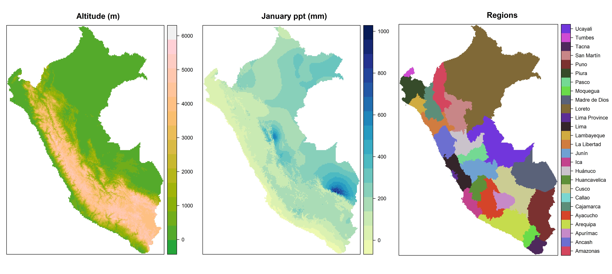

**rasterDT**: fast alternatives to **raster** package functions. 
=========

**rasterDT** uses the fast indexing, aggregation, and assignment
operations provided by **data.table** to power speedy alternatives to
several **raster** package functions. The functions that it provides
are between 5 and 25 times faster than the **raster** package
functions that they replace.

Installation
------------

Use [**devtools**](https://cran.r-project.org/package=devtools) to
install the current version of **rasterDT**:

``` r
devtools::install_github("JoshOBrien/rasterDT")
```

Usage
-----

**rasterDT** functions take the same arguments as their **raster**
package equivalents and are designed (with a very few exceptions) to
return the same values. Like their **raster** equivalents, they work
with rasters that are too large to hold in memory and (with the
exception of **fasterizeDT**) on `RasterLayer`, `RasterStack` and
`RasterBrick` objects.

Because this package leans so heavily on **data.table**, tabular
results are returned as `data.table`s instead of `data.frame`s. If you
would prefer a `data.frame`, just wrap a `data.table` object in a call
to `data.frame()`.


Performance
-----------

Let's compare the speed of **rasterDT** functions with their
**raster** package equivalents. To do so using realistic data, first
use `raster::getData()` to download and prepare three raster layers
which display the altitude, January precipitation, and political
regions of Peru at a resolution of one half arc minute.

(**PLEASE NOTE:** running the (fully reproducible) code below will
download several raster files into the working directory of your
current **R** session.)

``` r
library(rasterDT)
library(rasterVis)
library(microbenchmark)

## Altitude in m
altitude <- getData("alt", country = "PER", res = 0.5)
altitude <- crop(altitude, extent(altitude) - c(0, 0.2))

## Political subdivisions (categorical)
regions_shp <- getData("GADM", country = "PER", level = 1)
regions <- fasterizeDT(regions_shp, altitude, field = "NAME_1")

## January precipitation in mm
precip <- getData("worldclim", var = "prec", res = 0.5,
                  lon = -75, lat = -15)
precip1 <- crop(precip[[1]], regions)
precip1 <- mask(precip1, regions)
```
<br/>

The three resulting rasters are displayed (using plotting calls not
shown here) in the figure below:


<br/>

Next, to estimate the degree of speedup gained by using each
**rasterDT** function relative to its **raster** package equivalent,
we benchmark pairs of functions, executing equivalent calls 5 times
and comparing the average timings:

### `freqDT()` vs. `freq()`: ~6x speedup

``` r
microbenchmark(freqDT = freqDT(altitude),
               freq   = freq(altitude),
               times = 5)
## Unit: milliseconds
##    expr       min        lq      mean    median        uq       max neval cld
##  freqDT  358.1587  373.9958  402.0715  375.5939  404.4736  498.1357     5  a
##    freq 2481.5614 2570.1578 2583.9395 2605.2673 2611.1084 2651.6024     5   b

out_freqDT <- freqDT(altitude)
out_freq <- freq(altitude)
```
<br/>

### `crosstabDT()` vs `crosstab()`: ~6x speedup

``` r
microbenchmark(crosstabDT = crosstabDT(altitude, regions),
               crosstab   = crosstab(altitude, regions),
               times = 5)
## Unit: milliseconds
##        expr       min        lq     mean    median       uq      max neval cld
##  crosstabDT  934.0795  934.6892 1028.893  979.0466 1147.490 1149.160     5  a
##    crosstab 6274.8551 6430.1598 6439.387 6454.1255 6509.927 6527.869     5   b

out_crosstabDT <- crosstabDT(altitude, regions)
out_crosstab <- crosstab(altitude, regions)
```
<br/>

### `zonalDT()` vs `zonal()`: ~11x speedup

``` r
microbenchmark(zonalDT = zonalDT(altitude, regions, min),
               zonal   = zonal(altitude, regions, min),
               times = 5)
## Unit: milliseconds
##     expr       min        lq      mean    median        uq       max neval cld
##  zonalDT  200.5657  204.6846  206.6882  207.9012  209.0513  211.2381     5  a
##    zonal 2195.7178 2199.3366 2242.2448 2219.9958 2266.3005 2329.8735     5   b

out_zonalDT <- zonalDT(altitude, regions, min)
out_zonal <- zonal(altitude, regions, min)
```
<br/>

### `subsDT()` vs `subs()`: ~23x speedup

``` r
dict <- zonalDT(altitude, regions, min, na.rm = TRUE)
microbenchmark(subsDT = subsDT(regions, dict),
               subs   = subs(regions, dict),
               times = 5)
## Unit: milliseconds
##    expr       min        lq      mean    median        uq       max neval cld
##  subsDT  250.4851  254.4848  356.3356  259.0266  293.7392  723.9421     5  a
##    subs 8077.3643 8086.8702 8167.4095 8184.9779 8186.2390 8301.5961     5   b

out_subsDT <- subsDT(regions, dict)
out_subs <- subs(regions, dict)
```
<br/>

### `fasterizeDT()` vs `rasterize()`: ~25x speedup

Unlike the other functions in this package, `fasterizeDT()` does not
use **data.table** "under the hood" to speed up its
computations. Instead, it is a wrapper for
[fasterize::fasterize](https://github.com/ecohealthalliance/fasterize),
a terrifically fast function for rasterizing spatial polygons into
`RasterLayer`s.

`rasterDT::fasterizeDT()` cures several infelicities of
`fasterize::fasterize()`. Most usefully, unlike
`fasterize::fasterize()`, `fasterizeDT()` properly handles
rasterization operations in which either the template `RasterLayer` or
the selected polygon feature field is a factor. Specifically,
`fasterizeDT()` always returns a raster whose type (numeric or factor)
and levels (if a factor) match that of the spatial polygon attribute
indicated by its `field=` argument. (See
[here](https://github.com/ecohealthalliance/fasterize/issues/26) for
more details.)

``` r
## rasterize()'s field= argument can handle factor but not character vectors
regions_shp$NAME_FAC <- factor(regions_shp$NAME_1)
microbenchmark(fasterizeDT = fasterizeDT(regions_shp, altitude, field = "NAME_FAC"),
               rasterize   = rasterize(regions_shp, altitude, field = "NAME_FAC"),
               times = 5)
## Unit: milliseconds
##         expr        min         lq      mean     median         uq       max
##  fasterizeDT   48.09048   49.00721  107.8917   51.78699   52.29528  338.2786
##    rasterize 2693.34767 2734.66681 2748.1537 2763.89009 2771.21738 2777.6464

out_fasterizeDT <- fasterizeDT(regions_shp, altitude, field = "NAME_FAC")
out_rasterize   <- rasterize(regions_shp, altitude, field = "NAME_FAC")
```

